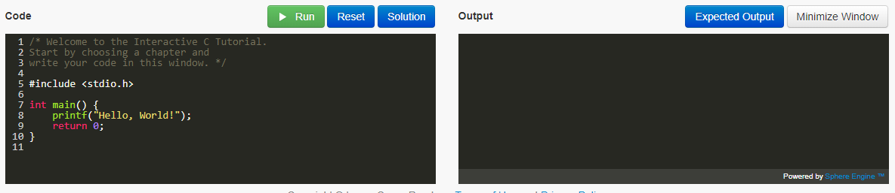

# Terminal Overview

> "Name 10 terminal commands"

That was a prompt I was given when interviewing for LinkedIn several years ago, and that was not the first time someone had asked me about the terminal at an interview! It's not that you should memorize 10 terminal commands, but rather you should understand that working on the terminal is an essential skill.

In this lab, you are going to perform a few terminal commands to get familiar with the Unix Environment.

## Part 0 - Obtain the mono repo

1. Make sure you have accepted the invitation to the monorepo from the main course page.
2. Run through the following github tutorial if you are not familiar with git.
  - https://guides.github.com/introduction/git-handbook/
  - This is worth the 15 minutes it takes to avoid headaches later on!
  - Video guides if needed: https://www.youtube.com/githubguides

## Part 1 - SSH

**I don't care what operating system you use as long as you have a terminal**

* For Windows Users installing Putty is sufficient. (https://www.putty.org/)
  * You might prefer to also install the bash shell from the Windows Store as well. (https://docs.microsoft.com/en-us/windows/wsl/install-win10)
* For Linux/Mac users, you already have a terminal available! Just search for 'terminal'.
* We additionally will install a virtual machine which you may work from, and which has a terminal.
* Once your terminal is open, 'ssh' into ccis with: `ssh ccis_user_name_here@login.ccs.neu.edu`
  * If for some reason you do not have a ccis username, let me know. We'll have to e-mail operations.
* After you have successfully ssh'd, you are now running programs on the ccis servers (not locally on your machine).
* Now you may 'git clone' the mono repo to this location (Presumably you have done this if you are reading this text).

## Part 2 - The (at least) 10 Commands

Try running the following commands.

1. ls
2. mkdir
3. cd
4. man
5. rmdir
6. sort
7. cat
8. nl
9. cut
10. grep

Some other nice things to know with the terminal
* Pressing up and down arrowkeys iterates through your command history (There is also a commmand called *history* you can checkout).
* Pressing *tab* autocompletes if it finds a program, command, or file path.
* Pressing Ctrl+C sends a signal to the terminal to terminate a program if it gets stuck.
* Pressing Ctrl+Z sends a signal to the terminal to suspend a program and give you back control.
  * You can play with these by typing in *sleep 10* (which puts the terminal to sleep) for 10 seconds, and see how you can terminate this program.

**A bit of precision** on calling each of these 'commands' is not really correct. Each of these is itself a program (typically implemented in C).

As an example, here is the source code for 'ls': http://git.savannah.gnu.org/cgit/coreutils.git/tree/src/ls.c
Each of these commands are part of the coreutils package in Unix. If you look through the source tree, you will additionally find many other programs (i.e. terminal commands you run in your shell) here: http://git.savannah.gnu.org/cgit/coreutils.git/tree/src/.

## Part 3 - Learn-C

The main programming language we will be using in this course is "C".

Complete the 'Learn the Basics' section of the C tutorial on the web from http://www.learn-c.org/

- Hello, World!
- Variables and Types
- Arrays
- Multidimensional Arrays
- Strings
- For loops
- While loops
- Functions
- Static

Once you are comfortable, try writing one of these tutorials in the command-line using either VIM, emacs, or nano text editors.

You can compile your program with: `clang main.c -o main` to see if it works. 

Here is a little tutorial on VIM as a resource: https://www.howtoforge.com/vim-basics (Note I use VIM, and have limited knowledge of other editors, but you are free to use what you like).

## Part 4 - The Network is down!

Sometimes ssh is not available if the internet is not. Hmm, how will we then work on our CCIS machines which are in a linux environment? The solution is to install locally (i.e. your desktop machine) a virtual machine. A virtual machine emulates an entire operating system!

The instructions to get setup are here:

* First start downloading the operating system I recommend using: Ubuntu https://www.ubuntu.com/download/desktop
  * While our CCIS machines are actually CentOS for the operating system, Ubuntu will work just fine (They core kernel is the same).
  * The download is rather large, so start with this step! :)
* Visit https://www.virtualbox.org/
* Download the binary for Virtual box 5.2 or later.
  1. This will show up as "Windows hosts" for window users, OSX hosts for mac users, etc.
* Install the program using the default installation settings (i.e. you will click 'next' a bunch of times).
* When installation has completed, launch Virtaul Box.
* Next click 'new' in the top right, and select *Linux* from the 'Type' dropbown box.
  1. You can name it something like 'myUbuntuMachine'
  2. Click 'next'
  3. You can then configure the memory size. I recommend at least 4096 MB (Unless that is not more than half of what you have available).
  4. Click 'next' and then create a Virtual Hard disk(default option). This essentially creates a giant file that acts like a hard drive.
  5. You can create a VDI (Virtual Disk Image). Click next.
  6. For the storage, you can select 'Dynamically allocated'
* Okay, now you are configured, and ready to boot your OS!
  1. Go ahead and right-click on your machine name, and select 'start'. 
  2. This will begin launching your virtual machine (It may take a few minutes to create some files)
  3. The first dialog will ask where your media is, and you will select wherever you downloaded the Ubuntu 18 .iso file (in step 1).
  4. Then run through the 'normal install'
  5. Follow the dialogs to install Ubuntu.
  6. Remember, you are working within a virtual environment, so this installation is only taking place within virtual box.
  7. From within Ubuntu, try opening a terminal. Run `sudo apt-get install build-essential` to make sure you get some tools(like our compiler gcc) setup.

Of course if you have a linux machine you may not need a virtual machine. What is nice about a virtual machine however, is if you mess something up, you can always reboot it and start from scratch very easily.

## More resources to help

- There is a lovely user manual on Virtual Box here: https://www.virtualbox.org/manual/
- There is another example of installing an older Ubuntu on an older version of virtual box here with pictures: https://askubuntu.com/questions/142549/how-to-install-ubuntu-on-virtualbox
- If you are not comfortable with compiling a C program on the terminal, take a look at this resource: https://www.cs.fsu.edu/~myers/howto/g++compiling.txt
- Hackerrank has an excellent series of shell tutorials here: https://www.hackerrank.com/domains/shell/bash
  - I highly recommend going through them if you are not comfortable with the shell.

## Deliverable

* Copy and Paste the output from the command-line interface of you running five different terminal commands above into a file called "output.txt" (no capitalization, exactly as named.)
  * Make sure to 'commit' this file to the repo in this directory.
* Take a screenshot of your virtual machine running. Name it 'ubuntu.jpg'
  * Make sure to 'commit' this file to the repo in this directory.
* Modify the file called 'main.c' in your respository containing one of the learn-c.org examples that you programmed using VIM.
  * Make sure to 'commit' this file to the repo in this directory.
  
## Going Further

(Some more programs to research and try out

1. history
2. tree
3. touch
